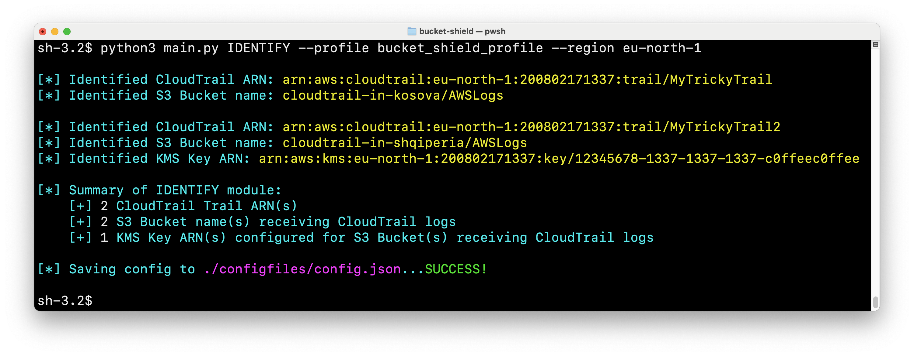

# BucketShield

**Permiso:** [https://permiso.io](https://permiso.io/)

**Read our release blog:** https://permiso.io/blog
bucketshield-track-log-flow-secure-buckets-simulate-threats

**Release Date: November 2nd, 2024**

**Event: BSides Chicago** 

BucketShield is an open-source tool designed to simulate and detect numerous actions that can disrupt the flow of AWS CloudTrail logs to their configured S3 Buckets. The targeted resources include CloudTrail Trails, configured S3 Buckets for storing these logs, and potential KMS Keys for encrypting the logs at rest. Additionally, BucketShield simplifies the process of enumerating and identifying these related resources so defenders can better understand which resources should be monitored.

## Required Packages

>```bash
># Optional: Set up a virtual environment
>python3 -m venv ./venv
>source venv/bin/activate
>
># Install required dependencies
>python3 -m pip install -r requirements.txt
>```

## **IDENTIFY Module**

Start by running the **IDENTIFY** script to enumerate in-scope resources and write to a local configuration file to be used later by the DEFEND modules. 

```python
python3 main.py IDENTIFY --help
usage: BucketShield IDENTIFY [-h] -p PROFILE -r REGION [-o OUTPUT]

python3 main.py IDENTIFY --profile bucket_shield_profile --region eu-north-1
```


*Invocation of IDENTIFY module to enumerate in-scope resources.*


*Configuration file generated by IDENTIFY module.*

## **DEFEND Module**

Next run the **FLOWLOGS** script to quickly see the most recent CloudTrail log written to each configured S3 Bucket specified in the configuration file. This is a quick sanity check to ensure CloudTrail Trails are currently forwarding logs to the corresponding S3 Buckets.

```python
python3 main.py FLOWLOGS --help
usage: BucketShield FLOWLOGS [-h] [-c CONFIG_FILE]

python3 main.py FLOWLOGS --config-file "./configfiles/config.json"
```


*Invocation of FLOWLOGS module to list most recent event in each configured S3 Bucket.*

Proceed to run the DETECT script to search the CloudTrail API to identify any dangerous events referencing any resource (CloudTrail Trail, S3 Bucket or KMS Key) specified in the configuration file.

```python
python3 main.py DETECT --help
usage: BucketShield DETECT [-h] [-p PROFILE] [-d DAYS_LOOKBACK] [-s START_TIME] [-e END_TIME] [-c CONFIG_FILE] [-o OUTPUT]

python3 main.py DETECT --profile bucket_shield_profile --days-lookback 4
```


*Invocation of DETECT module to search the CloudTrail API for dangerous events affecting resources in the configuration file.*

## **ATTACK Module**

The ATTACK script is optional and is helpful to simulate the attacks on a newly-created CloudTrail Trail, S3 Bucket and KMS Key in a non-production environment. **We do not assume responsibility for any damages that might occur in relation to this ATTACK script.**

```python
python3 main.py SIMULATE --help
usage: BucketShield SIMULATE [-h] -p PROFILE -r REGION [-rn RESOURCE_NAME] [-as {kms,s3,cloudtrail}]
```


## **General Setup for Attack Simulation Scenarios**

- **IAM User**: Create an IAM user specifically for these tests (e.g., BucketShield).

- **Resources**:
    - **S3 Bucket:** **`bucketshield-test-bucket`** for S3 bucket tests.
    - **CloudTrail**: **`bucketshield-test-trail`** for CloudTrail tests.
    - **KMS Key**: **`bucketshield-test-key`** for KMS key tests.

- **S3 Bucket Configurations**
  - **Block Public Access**: Must be disabled to allow public access settings during tests.
  - **ACLs**: Must be enabled to test ACL-related operations.
  - **Inline Policies**:
  
## Basic S3 Operations

```jsx
{
  "Version": "2012-10-17",
  "Statement": [
    {
      "Effect": "Allow",
      "Action": [
        "s3:ListBucket",
        "s3:PutObject",
        "s3:GetObject",
        "s3:PutBucketPolicy"
      ],
      "Resource": "arn:aws:s3:::bucketshield-test-bucket/*"
    }
  ]
}
```

```jsx
{
  "Version": "2012-10-17",
  "Statement": [
    {
      "Sid": "VisualEditor0",
      "Effect": "Allow",
      "Action": "s3:PutBucketAcl",
      "Resource": [
        "arn:aws:s3:::bucketshield-test-bucket",
        "arn:aws:s3:::bucketshield-test-bucket/acl",
        "arn:aws:s3:::bucketshield-test-bucket/bla"
      ]
    }
  ]
}
```
## **S3 Bucket Configurations**

- **Inline Policy for CloudTrail Operations**:
  
```jsx
S3 Bucket Configurations
Inline Policy for CloudTrail Operations:
{
  "Version": "2012-10-17",
  "Statement": [
    {
      "Effect": "Allow",
      "Action": [
        "cloudtrail:StopLogging",
        "cloudtrail:DescribeTrails",
        "cloudtrail:GetTrailStatus",
        "cloudtrail:StartLogging",
        "cloudtrail:CreateTrail",
        "cloudtrail:DeleteTrail"
      ],
      "Resource": [
        "arn:aws:s3:::bucketshield-test-bucket",
        "arn:aws:s3:::bucketshield-test-bucket/*",
        "arn:aws:cloudtrail:eu-north-1:200802171337:trail/bucketshield-test-trail"
      ]
    }
  ]
}
```

## KMS Key Testing Order
  
Key Operation Sequence: Ensure that after disabling a key, you re-enable it before proceeding to other operations such as EnableKeyRotation or PutKeyPolicy. 
Similarly, if ScheduleKeyDeletion is executed, ensure to run CancelKeyDeletion immediately afterwards to avoid disruption of subsequent tests.

## Contributing
Contributions are welcome!
Feel free to reach out for any questions or feedback.
